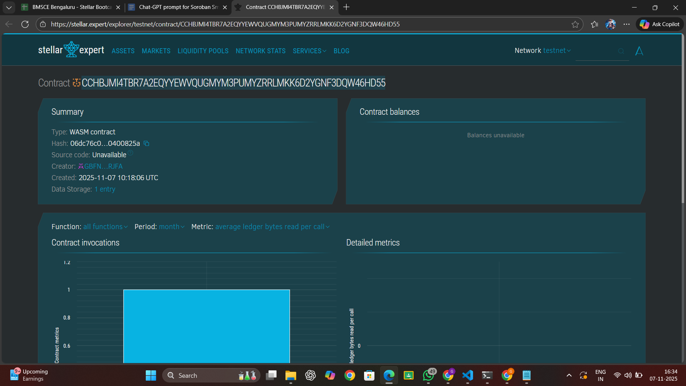

# Cross-Border Remittance App

## Project Title
**Cross-Border Remittance Smart Contract on Stellar**

## Project Description
The Cross-Border Remittance App is a decentralized application built on the Stellar blockchain using Soroban smart contracts. This application enables fast, low-cost international money transfers by leveraging Stellar's payment paths and smart contract capabilities. The system provides a transparent, secure, and efficient way to send money across borders without the high fees and delays associated with traditional banking systems.

The smart contract manages the entire remittance lifecycle, from transaction initiation to completion, while maintaining a complete audit trail of all cross-border transfers.

## Project Vision
Our vision is to revolutionize the global remittance industry by:

- **Democratizing Access**: Making international money transfers accessible to everyone, especially underserved populations in developing countries
- **Reducing Costs**: Eliminating excessive fees charged by traditional remittance services, allowing more money to reach recipients
- **Increasing Speed**: Enabling near-instantaneous transfers instead of the 3-5 day wait times common with traditional services
- **Enhancing Transparency**: Providing complete visibility into transaction status and fees through blockchain technology
- **Building Trust**: Using immutable smart contracts to ensure secure and reliable cross-border payments

We envision a world where sending money across borders is as simple and affordable as sending a text message, empowering millions of migrant workers and their families worldwide.

## Key Features

### 1. **Instant Remittance Initiation**
- Users can initiate cross-border transfers with just a few parameters: sender address, recipient address, amount, and currency
- Smart contract validates the transaction and creates a unique transaction ID for tracking
- Authorization required from the sender to ensure security

### 2. **Transaction Tracking**
- Each remittance is assigned a unique transaction ID
- Users can query transaction details at any time using the transaction ID
- Complete transaction history including sender, recipient, amount, currency, timestamp, and status

### 3. **Status Management**
- Transactions progress through clear states: PENDING → COMPLETED
- Payment processors or oracles can mark transactions as completed once funds are delivered
- Prevents duplicate processing with status verification

### 4. **Multi-Currency Support**
- Flexible currency parameter allows support for various fiat and cryptocurrencies
- Leverages Stellar's built-in currency conversion capabilities
- Easy integration with Stellar's payment paths for optimal exchange rates

### 5. **Secure Authorization**
- Sender authorization required for initiating transfers
- Processor authorization required for completing transactions
- Address-based authentication ensures only authorized parties can perform actions

### 6. **Persistent Storage**
- All transaction data stored on-chain with extended TTL (Time To Live)
- Maintains complete audit trail for compliance and dispute resolution
- Transaction counter tracks total number of remittances processed

## Future Scope

### Short-term Enhancements
1. **Fee Structure Implementation**
   - Add configurable fee percentages for different transaction sizes
   - Implement fee collection mechanism for platform sustainability
   - Dynamic fee adjustment based on network conditions

2. **Multi-signature Support**
   - Enable businesses to require multiple approvals for large transfers
   - Add co-signer functionality for enhanced security

3. **Transaction Cancellation**
   - Allow users to cancel pending transactions before completion
   - Implement refund mechanism with appropriate safeguards

### Medium-term Features
1. **Recurring Payments**
   - Enable scheduled, automatic remittances
   - Support for monthly family support transfers
   - Smart contract-based subscription management

2. **Exchange Rate Oracle Integration**
   - Real-time exchange rate feeds from trusted oracles
   - Display estimated recipient amount in local currency
   - Rate lock mechanism for guaranteed exchange rates

3. **Compliance Features**
   - KYC/AML integration for regulatory compliance
   - Transaction limits based on verification levels
   - Automated reporting for regulatory authorities

4. **Beneficiary Management**
   - Save and manage multiple recipient addresses
   - Recipient verification system
   - Contact book integration

### Long-term Vision
1. **Mobile Application**
   - User-friendly mobile apps for iOS and Android
   - QR code scanning for easy recipient address input
   - Push notifications for transaction status updates

2. **Agent Network**
   - Cash pickup locations for recipients without bank accounts
   - Integration with local payment providers
   - Agent commission management system

3. **AI-Powered Features**
   - Fraud detection using machine learning
   - Optimal routing suggestions for best rates
   - Predictive analytics for transaction timing

4. **Cross-Chain Interoperability**
   - Bridge to other blockchain networks
   - Support for multiple blockchain-based currencies
   - Unified interface for cross-chain transfers

5. **DeFi Integration**
   - Liquidity pool integration for better rates
   - Yield-generating options for remittance recipients
   - Stablecoin support for reduced volatility

6. **Impact Tracking**
   - Dashboard showing total fees saved compared to traditional services
   - Community impact metrics
   - Carbon footprint tracking vs. traditional banking

---

## Technical Specifications

### Smart Contract Functions

#### `send_remittance`
Initiates a new cross-border remittance transaction.
- **Parameters**: sender address, recipient address, amount, currency symbol
- **Returns**: Unique transaction ID
- **Authorization**: Requires sender signature

#### `complete_remittance`
Marks a pending transaction as completed.
- **Parameters**: transaction ID, processor address
- **Authorization**: Requires processor signature

#### `get_remittance`
Retrieves details of a specific transaction.
- **Parameters**: transaction ID
- **Returns**: Complete remittance record

#### `get_total_transactions`
Returns the total number of remittances processed.
- **Returns**: Transaction count

### Data Structures

#### Remittance
- `sender`: Address of the sender
- `recipient`: Address of the recipient
- `amount`: Transfer amount (i128)
- `currency`: Currency symbol
- `timestamp`: Transaction creation time
- `status`: Current transaction status
- `tx_id`: Unique transaction identifier

---

## Building and Deployment

### Prerequisites
- Rust programming language
- Soroban CLI
- Stellar account with test tokens

### Build Command
```bash
stellar contract build
```

### Deployment
```bash
stellar contract deploy \
  --wasm target/wasm32-unknown-unknown/release/remittance_contract.wasm \
  --network testnet
```

---

## Contributing
We welcome contributions from the community! Please feel free to submit issues, fork the repository, and create pull requests.

## License
This project is licensed under the MIT License.

## Contact
contract ID:
CCHBJMI4TBR7A2EQYYEWVQUGMYM3PUMYZRRLMKK6D2YGNF3DQW46HD55

